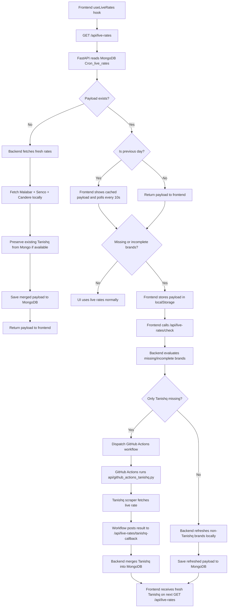
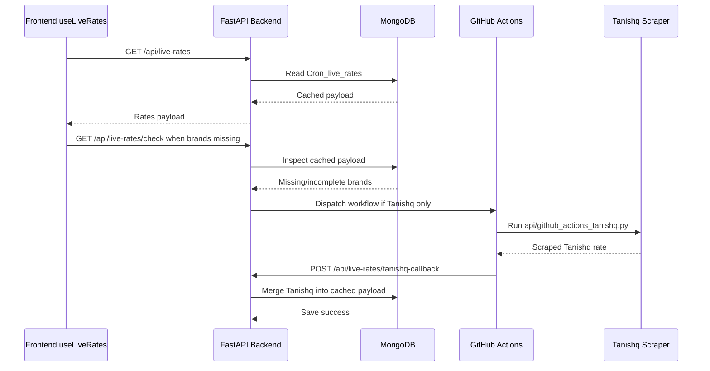

# Live Rates Flow

This document describes the current end-to-end flow for live gold rate fetching, caching, retries, cron refreshes, and the Tanishq GitHub Actions handoff.

## High-Level Flow

## Backend Endpoints

- `GET /api/live-rates`
- `GET /api/live-rates/check`
- `GET /api/live-rates/fetch-tanishq`
- `POST /api/live-rates/tanishq-callback`
- `GET /api/cron/update-rates`

## What Each Piece Does

### 1. Frontend hook
File: [frontend/hooks/useLiveRates.js](frontend/hooks/useLiveRates.js)

- Fetches live rates from `/api/live-rates`.
- Normalizes the payload and stores it in `localStorage`.
- Checks whether `Tanishq`, `Kalyan`, `Malabar`, and `Senco` are all present.
- If brands are missing, it calls `/api/live-rates/check` for backend diagnostics and retry logic.
- If the payload is marked as previous-day data, it starts polling every 10 seconds.

### 2. MongoDB cache
File: [api/main.py](api/main.py)

- MongoDB collection: `Cron_live_rates`
- Mongo stores the latest merged payload under `_id: "latest"`.
- If Mongo has an older payload, the backend marks it as stale/previous-day.

### 3. Cron refresh
File: [api/main.py](api/main.py)

- `GET /api/cron/update-rates` is the scheduled refresh entrypoint.
- It refreshes the live rates payload and persists the result to MongoDB.
- Current behavior fetches non-Tanishq brands locally and preserves any existing Tanishq entry from MongoDB.

### 4. GitHub Actions Tanishq path
Files:
- [.github/workflows/tanishq-live-rates.yaml](.github/workflows/tanishq-live-rates.yaml)
- [api/github_actions_tanishq.py](api/github_actions_tanishq.py)
- [api/tanishq_fetcher.py](api/tanishq_fetcher.py)

- When Tanishq needs a refresh, the backend dispatches a workflow in GitHub Actions.
- The workflow installs Python dependencies and runs the Tanishq fetcher script.
- The script sends the fetched Tanishq rate back to the backend callback endpoint.
- The backend merges that rate into the existing MongoDB payload.

## Retry Behavior

### Case 1: One brand missing
- Frontend detects missing brands.
- It calls `/api/live-rates/check`.
- Backend checks whether only Tanishq is missing.
- If yes, backend dispatches the GitHub Actions workflow for Tanishq only.

### Case 2: Tanishq missing, others present
- Backend queues GitHub Actions for Tanishq.
- Existing payload stays in MongoDB until the callback returns.
- Once the callback arrives, Tanishq is merged into the cached payload.

### Case 3: Two or more brands missing
- Backend refreshes the non-Tanishq brands locally.
- Tanishq stays preserved from MongoDB if it exists.
- If the payload is still incomplete, the frontend keeps polling when previous-day data is visible.

### Case 4: Fresh fetch fails
- Frontend falls back to `localStorage`.
- UI can still render stale data instead of going blank.

## Important Caveat

The frontend hook still contains a call to `/api/live-rates/trigger`, but there is no backend route for that endpoint right now. So the real working retry path is the `/api/live-rates/check` endpoint plus the GitHub Actions Tanishq workflow.

## Operational Requirements

These env vars are needed for the GitHub Actions path:

- `GITHUB_TOKEN`
- `GITHUB_REPOSITORY`
- `BACKEND_API_URL` or `PUBLIC_BACKEND_URL`
- `TANISHQ_CALLBACK_SECRET`
- Optional: `GITHUB_TANISHQ_WORKFLOW_FILE`
- Optional: `GITHUB_TANISHQ_WORKFLOW_REF`

## Recommended Mental Model

